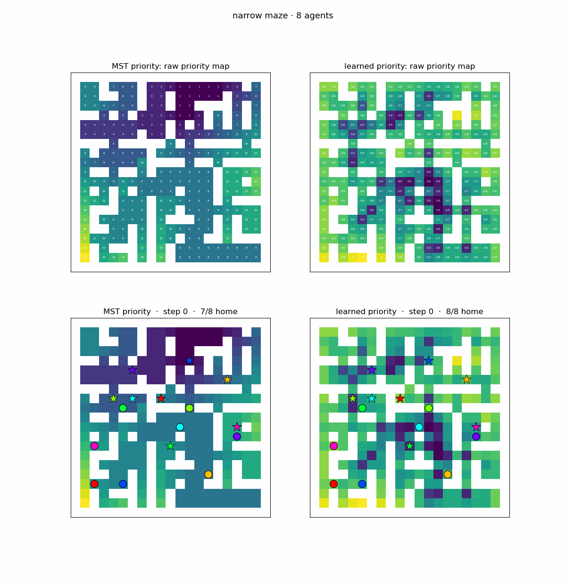

# Learned Priority Fields for Communication-Free Multi-Agent Deadlock Resolution

A deep-learning replacement for the **position-based priority assignment** in
*"Asynchronous Communication-free Multi-Agent Trajectory Planning and Deadlock
Resolution in Maze-like Environments"* (IEEE T-RO submission 26-0057).

The paper resolves deadlocks by giving every grid cell a **position priority**
derived from an MST "priority tree" (Sec. IV-C, Eq. 12). Lower-priority agents
yield to higher-priority ones. Because priority is a deterministic function of
`(cell, known map)`, every agent computes the *same* field offline — which is
what makes it work **without communication**.

This project asks: *can a learned priority field beat the hand-designed MST one?*

## Why this is a sound place to apply learning

1. **Consistency by construction.** We learn a function `map → priority field`
   evaluated offline and shared by all agents. It cannot produce contradictory
   orderings between agents the way a per-agent runtime policy could under
   limited sensing. The communication-free guarantee is preserved.
2. **Safety is priority-independent.** In the paper, collision avoidance comes
   from ABVC + SFC + the final-stop constraint (Theorems 1–2), *not* from
   priority. So a learned field can only affect deadlock / livelock / efficiency
   — it can never cause a collision. We can therefore experiment freely.

## What is modeled (grid-MAPF abstraction)

Priority feeds **PIBT** (the paper's MAPF solver) and the conflict checks. We
therefore evaluate priority quality at the grid/PIBT level — fast, fully
observable, and where the priority's effect is decisive — rather than
reimplementing the continuous ABVC + SFC + QP stack.

```
map (occupancy) ──► priority field ──► PIBT per-step ──► episode ──► metrics
                  (MST / CNN / Transformer)  (+ yield)             success/makespan/flowtime
```

- `src/envs/grid.py`     — occupancy grid, BFS distances, random-forest & braided-maze generators
- `src/envs/pibt.py`     — PIBT (Priority Inheritance with Backtracking)
- `src/envs/simulator.py`— episode runner; assembles agent priority from the field
  (Eq. 13) and resolves deadlocks with the paper's two-branch scheme (Alg. 3): a
  **deadlock** (frozen agent blocked head-on, Eq. 14) triggers the **right-hand
  rule** (Eq. 15 — sidestep perpendicular and away from the blocker); a
  **livelock** (stuck lower-priority agent, Eq. 18) backs out to its
  lowest-priority neighbour (Alg. 3 lines 11-12). A legacy `yield_mode="beta"`
  push-through boost is also available. Either way the mechanism is applied
  identically to every method, so the **field is the only variable**.
- `src/priority/mst_baseline.py` — the paper's MST position-priority field (the baseline to beat)
- `src/priority/model.py`        — `PriorityUNet`: CNN mapping map features → per-cell field
- `src/priority/model_transformer.py` — `PriorityTransformer`: CNN stem + self-attention
  alternative (`--arch transformer`); same map-features → per-cell field contract
- `src/priority/features.py`     — map-only input channels (no live positions ⇒ comms-free)
- `src/train/oracle.py`          — candidate-bank search producing imitation labels
- `src/train/rl.py`              — group-baseline REINFORCE (GRPO-style) over whole-field actions
- `src/train/reward.py`          — configurable reward weights (`reward_weight.yaml`)
- `src/eval/benchmark.py`        — apples-to-apples held-out comparison
- `src/utils/experiment.py`      — per-run logging dir (config, TensorBoard, checkpoints, model snapshot)

## Quickstart

```bash
pip install -r requirements.txt

# 0. sanity check the env + baseline
python scripts/smoke_test.py

# 1. generate imitation labels (oracle search per map). --oracle picks the PIBT
#    deadlock-resolution mode used to score candidates; the headline model is
#    trained in-distribution under "paper" (right-hand rule + livelock).
python scripts/gen_dataset.py --out data/imitation.npz --n_maps 150 --oracle paper

# 2. imitation pretraining -- the headline model is the Transformer (--arch
#    transformer); omit --arch for the default U-Net. The architecture is recorded
#    in the checkpoint and inherited automatically through RL / eval / viz.
python scripts/train_imitation.py --data data/imitation.npz \
    --arch transformer --dim 32 --depth 3 --dropout 0.1 --out runs/imitation_transformer.pt

# 3. RL fine-tuning (hybrid: warm-start from imitation, anchor to prevent forgetting;
#    the arch is inherited from --init. --oracle paper trains under the same
#    dynamics used for eval and also drives best.pt selection.)
python scripts/train_rl.py --init runs/imitation_transformer.pt --out runs/rl_transformer.pt --iters 200 --oracle paper

#    faster rollouts (cpu, exact PIBT): parallelize over a process pool
python scripts/train_rl.py --init runs/imitation_transformer.pt --out runs/rl_transformer.pt --iters 200 --oracle paper --workers 8

#    GPU-vectorized rollouts (GPU_vectorized branch): batch all episodes on the
#    GPU. ~4.5x faster training here, but uses an *approximate* non-backtracking
#    solver -- the learned field still transfers to PIBT (see docs/report_GPU-vectorized.md).
python scripts/train_rl.py --init runs/imitation_transformer.pt --out runs/rl_transformer.pt --iters 200 --engine vec

# 4. benchmark a checkpoint vs the MST baseline (match the training mode)
python scripts/evaluate.py --ckpt runs/rl_transformer.pt --oracle paper

# 5. watch it: animated MST-vs-learned episode on the same instance
python scripts/simulate.py --ckpt runs/rl_transformer.pt --map narrow --seed 54 --max_steps 60
```

## Experiment tracking & reward weights

Each `train_imitation` / `train_rl` run writes a self-contained directory
`logs/{script_name}_{timestamp}/` (gitignored):

| file | contents |
|------|----------|
| `config.yaml` | hyperparameters — imitation: `total_epochs`, `batch_size`, `learning_rate`; RL: `total_iters`, `sigma`, `learning_rate`, `n_agents`, … |
| `train.log` | progress (also echoed to stdout) |
| `events.out.tfevents.*` | TensorBoard scalars (`tensorboard --logdir logs`) |
| `model.py`, `features.py` | snapshots of the model architecture + input features used for the run |
| `*.pt` | checkpoints — `best.pt` (best-selected, mirrored to `--out`), plus RL's `checkpoint.pt`/`final.pt` (run dir only) |
| `reward_weight.yaml` | (RL) snapshot of the reward weights used |

RL reward shaping is configured in the tracked **`reward_weight.yaml`** at the
repo root (`--reward_weights` to override):

```yaml
success: 2.0     # weight on solving (all agents reach goals)
makespan: 0.5    # penalty on team finish time
flowtime: 0.5    # penalty on total effort
```

Raise `success` to push deadlock resolution harder; raise `makespan`/`flowtime`
to favor speed. The defaults reproduce the results below.

## Design notes / decisions

- **Map types.** `forest` (random blocks), `wide` maze (2-wide corridors),
  `narrow` maze (1-wide). Mazes are **braided** (`braid=`) — a perfect/tree maze
  leaves no room for two agents to pass in a 1-wide corridor, making it
  near-unsolvable rather than hard; braiding adds alcoves/loops.
- **Deadlock resolution (`yield_mode`).** A perfectly static field cannot resolve
  a 1-wide corridor — agents must move aside. The default `"paper"` mode ports
  **both** branches of the paper's Alg. 3:
  - **Deadlock → right-hand rule (Alg. 3 lines 6-9, Eq. 14→15).** Detected
    *before* the MAPF step: an agent that is frozen (zero grid velocity, Eq. 14a)
    with a neighbour occupying the cell directly ahead toward its goal (Eq. 14b)
    is routed by the **right-hand rule** — it sidesteps perpendicular to, and away
    from, the blocker (Eq. 15). Priority-independent, so a head-on pair both fire
    and pass on consistent opposite sides. Toggle with `deadlock_resolution`.
  - **Livelock → lowest-priority neighbour (Alg. 3 lines 11-13, Eq. 18).** The
    fallback after MAPF: a stuck *lower*-priority agent blocked by a
    higher-priority neighbour has its subgoal reassigned to the **lowest-priority
    adjacent node**, so it retreats to make room. (The *limited-sensing* conflict,
    Eq. 19, has nothing to fire on under full observability, so only the Eq. 18
    livelock condition is ported.)

  Deadlock takes precedence (Alg. 3 returns at line 8 before line 11). A legacy
  `"beta"` mode instead *raises* a stuck agent's priority so it pushes through;
  it resolves more deadlocks in this centralized PIBT grid but is less faithful to
  the paper. Training is pinned to `"beta"` (it is the more forgiving signal for
  RL); benchmark + visualization use `"paper"`. Fields are scale-normalized first
  so either mechanism treats the integer MST field and the learned softplus field
  equally. Grid adaptations of the continuous Eq. 14/15 thresholds (`vth`, `dth`,
  `dr`) are documented in the `simulator.py` module docstring.
- **Imitation target.** The optimal position-priority field is intractable, so
  the oracle scores a bank of candidate fields (MST rooted at different cells +
  geometry baselines) by simulation and keeps the best — a cheap proxy label.
- **Hybrid training.** Imitation gives a strong, stable init; RL then optimizes
  episode reward directly. An L2 anchor to the imitation logits curbs
  catastrophic forgetting.

## Results (held-out, 8 agents, 21×21, 500 instances/kind = 100 maps × 5)

Default **paper** deadlock resolution (right-hand rule + livelock), with the
corrected arrived-agent yield (finished agents get `-inf` priority so they always
make way — see the note below). The headline model is the **Transformer** field
trained **fully in-distribution** — paper-mode oracle labels → paper-mode RL →
paper-mode eval (`runs/rl_transformer.pt`, `dim=32`, best-by-success). `succ` =
success rate (higher better), `mksp` = makespan, `flow` = flowtime (lower better):

| map | MST baseline — succ / mksp / flow | Learned (Transformer, imit→RL) — succ / mksp / flow |
|-----|:---------------------------------:|:---------------------------------------------------:|
| forest | 92.6% / 27.0 / 127.9 | **94.0%** / 26.2 / 126.5 |
| wide   | 90.2% / 27.0 / 127.9 | **94.0%** / 25.7 / 125.2 |
| narrow | 60.6% / 32.4 / 151.6 | **63.2%** / 30.3 / 145.0 |

The learned field wins on **every metric on every map**, but by a **modest
margin** — +1.4–3.8pp success, with lower makespan and flowtime everywhere. The
honest takeaway: once the simulator resolves deadlocks correctly, the paper's
hand-designed **MST baseline is already strong** (60–93%), and the learned field
is a small, *consistent* improvement on top of it — not a dramatic one.

> **Why the baseline is this strong (a fixed bug).** Agents that reach their goal
> get **`-inf`** priority so they always yield (paper Eq. 13a). An earlier version
> priced them at `0`; because the field is z-scored per map, an en-route agent in
> a low-priority region could have a *negative* priority and so be unable to push a
> *finished* agent off a cell on its path — a permanent deadlock. That bug
> depressed all success rates and inflated the apparent learned-vs-MST gap (the
> learned field's smooth gradient happened to dodge it). With it fixed, both jump
> (MST narrow 42.8%→60.6%) and the true gap is small.

`runs/fields_rl_transformer.png` (from `scripts/visualize.py`) shows *where* the
learned field still helps: the MST field is piecewise-constant in coarse blocks
(the 4-cycle rule collapses whole open regions to one level), whereas the learned
field is a smooth fine-grained gradient — finer symmetry-breaking at junctions,
which is what buys the remaining few points (especially on `wide`/`narrow`).

Reproduce: `python scripts/evaluate.py --ckpt runs/rl_transformer.pt --n_per_kind 100 --n_inst 5`

### Watch the difference

`scripts/simulate.py` runs the *same* instance under both fields. In this
narrow-maze case (`--seed 54`) the MST priority **deadlocks** (7/8 agents home)
while the learned Transformer field **solves it in 25 steps** (8/8). The top row
shows the raw priority maps (MST integer levels vs the learned smooth field); the
bottom row animates the agents:



Reproduce: `python scripts/simulate.py --ckpt runs/rl_transformer.pt --map narrow --seed 54 --max_steps 60 --raw`

## Limitations / next steps

- Field is **map-only**; goals are common knowledge under the paper's
  assumptions, so a goal-conditioned field is a natural extension (a channel hook
  already exists in `features.py`).
- The grid abstraction omits continuous dynamics (ABVC/SFC/QP). The intended
  path is to drop the learned field into the full planner and confirm the gains
  transfer.
- A GNN over the grid graph (instead of a CNN) would generalize across map sizes
  without retraining.
```
